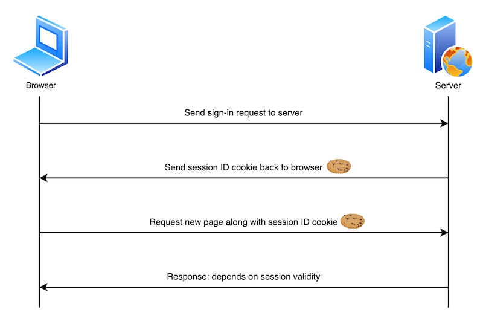
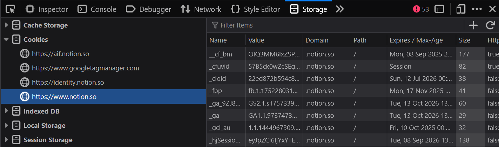
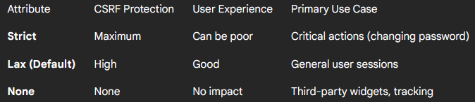
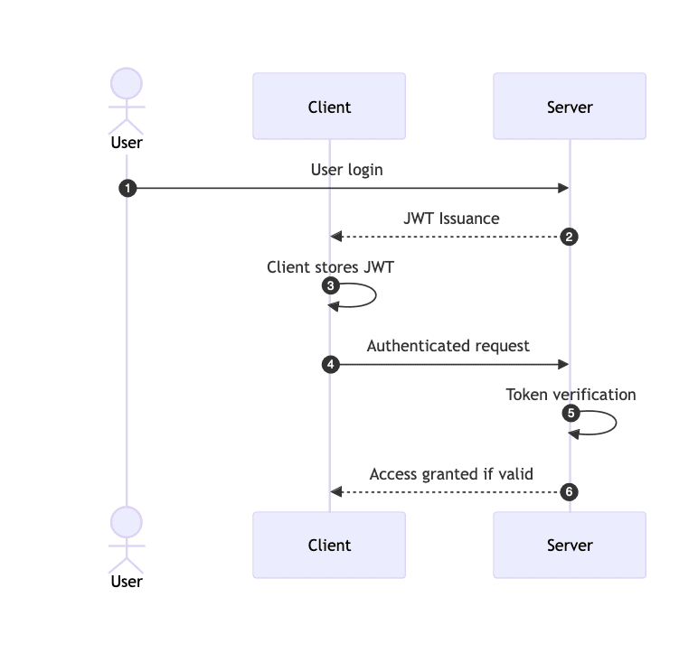

On the web, communication between client and server is normally done through requests of the HTTP(S) protocol. The HTTP protocol is a "stateless" protocol, meaning that requests are independent of each other, so by default, previous information is not carried over to subsequent requests. This is where cookies and tokens come in, allowing the user's session to persist with each HTTP request.

## What are Cookies?

They are small pieces of information that allow websites to recognize users and their preferences. Cookies are created by the server and are stored in the client's web browser for a customizable period of time. The browser can create, store, modify existing cookies, and send them back to the server in subsequent HTTP requests.

Cookies are used for three main purposes:
- `Session management`: Details related to the user's session that the server needs to maintain.
- `Personalization`: User preferences like language or page color.
- `Tracking`: Recording user behavior.



Once the server receives an HTTP request, it can send an HTTP response containing one or more Set-Cookie headers:

```bash
HTTP/2.0 200 OK
Content-Type: text/html
Set-Cookie: yummy_cookie=chocolate
Set-Cookie: tasty_cookie=strawberry

[page content]
```

Upon receiving the response, the browser will store the cookie's name and value (and its attributes) in its "Cookies" storage to be used in future HTTP requests:

```bash
GET /sample_page.html HTTP/2.0
Host: www.example.org
Cookie: yummy_cookie=chocolate; tasty_cookie=strawberry
```



Since the user's cookies are managed by the browser, it is necessary to set some attributes to ensure a minimum level of security, such as preventing JavaScript code from reading cookie values (XSS) or malicious users from forcing a user to make a request with their cookie (CSRF):

- `HttpOnly`: If a cookie has this attribute, its value cannot be accessed via JavaScript, providing security against attacks like XSS.
- `Secure`: If a cookie has this attribute, it will only be sent to the server over an encrypted channel, meaning it will not be sent in HTTP requests (except for localhost).
- `Domain`: An attribute that specifies which domain and/or subdomains can receive the cookie. For example, if the value is Domain=notion.so the cookie can be received by the notion.so domain and its subdomains.
- `Path`: An attribute that indicates which URL path must exist for the cookie to be sent.
- `SameSite`: An attribute that allows the server to specify whether cookies can be sent in cross-site requests (between different domains).
    - `Strict`: The browser will NEVER send the cookie in a cross-site request under any circumstances. This offers the strongest protection against CSRF attacks.
    - `Lax`: The browser will send the cookie in cross-site requests, but ONLY for top-level navigations and with "safe" HTTP methods (like GET). If "Strict" is not specified, most browsers will assume "Lax" as the default value.
    - `None`: The browser will ALWAYS send the cookie in cross-site requests, without restrictions.



:::important
1: In cases like these, involving cross-site requests, the browser will only send the cookies it has for the destination site. For example, the browser does not send cookies from `example.sitea.com` to `example.siteb.com`. It decides whether to send the cookies it already has stored for the destination site, i.e., the cookies for `example.siteb.com`.

2: A SameSite=Lax cookie is sent with `ANY` request made `WITHIN` the same site. When the request comes from a `DIFFERENT` site, it is ONLY sent if it is a navigation initiated by a user click (a GET request that changes the main URL), and `NOT` in form submissions (POST) or background requests.
:::


## What are Tokens?

A token is a sequence of characters, a "piece of data," that a server generates to represent a client's identity and permissions. Basically, it's a unique string that identifies requests coming from the same client.

Tokens are commonly used in modern web applications (SPAs) or native applications (mobile and desktop), creating a stateless authentication system.

Unlike Cookies, Tokens do not have a specific standard and can be sent as a query string, a header, in the body, etc. However, the most common standard in modern web applications is the JWT (Json Web Token). A JWT is divided into three parts: `Header.Payload.Signature`.



The flow is similar as follows:

1. `Login`: The client (browser, app) sends the username and password to the server.
2. `Generation`: The server validates the credentials. If they are correct, it generates a JWT, signing it with its secret key.
3. `Delivery`: The server sends the JWT back to the client in the body of the request's response.
4. `Storage`: The client stores the token (usually in the browser's Local Storage or Session Storage, or in the mobile app's memory).
5. `Authentication in Requests`: For each future request to a protected API route, the client adds the token to the Authorization header using the Bearer scheme. `Example header`: Authorization: Bearer xxxxx.yyyyy.zzzzz
6. `Validation on Server`: The server receives the request, extracts the token from the header, verifies that the signature is valid (using its secret key), and checks that the token has not expired (exp). If everything is correct, the request is authorized.


## Resources

https://developer.mozilla.org/en-US/docs/Web/HTTP/Guides/Cookies
https://developer.okta.com/blog/2022/02/08/cookies-vs-tokens
https://auth0.com/blog/cookies-tokens-jwt-the-aspnet-core-identity-dilemma/
https://dev.to/andychiare/sessions-tokens-and-rocknroll-4pdc
https://hasanthipurnimadissanayake.medium.com/cookie-based-authentication-vs-token-based-authentication-9c0dcce1d73a
https://nestenius.se/net/bearertoken-the-new-authentication-handler-in-net-8/
https://tryhackme.com/room/sessionmanagement
https://cheatsheetseries.owasp.org/cheatsheets/Session_Management_Cheat_Sheet.html