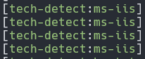
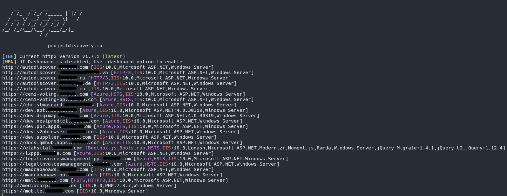
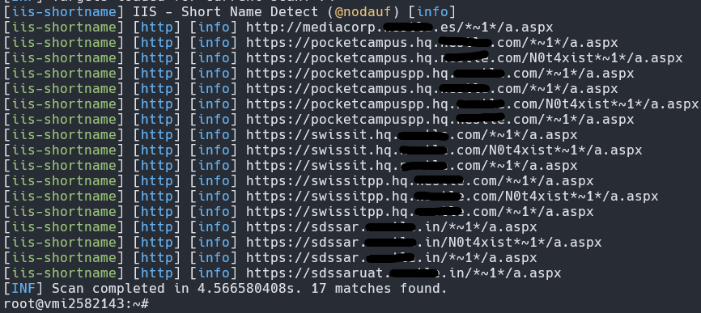
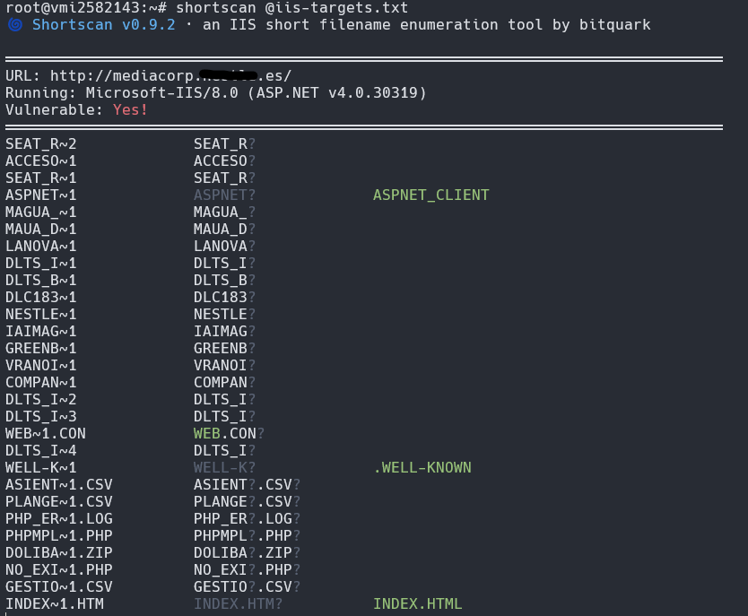

Hi there, sooo in this post I want to show how I identify hosts that use IIS and my initial approach. 


## Fingerprinting IIS

You can use nuclei or httpx with the tech detect flag on.

```bash
nuclei -list hosts.txt -t tech-detect.yaml
```


```bash
httpx -l subs.txt -td | grep "IIS" > iis-targets.txt
```



## It's possible to enumerate folders?

Use this nuclei template to identify if the IIS target is vulnerable to IIS shortname enumeration:

```markdown
https://raw.githubusercontent.com/projectdiscovery/nuclei-templates/d6636f9169920d3ccefc692bc1a6136e2deb9205/fuzzing/iis-shortname.yaml
```
Using the template:
```bash
nuclei -l iis-targets.txt -tags fuzz -include-templates nuclei-templates/http/fuzzing/iis-shortname.yaml -vv
```



## Short filename enumeration with shortscan

If the IIS host(s) is vulnerable to shortname enumeration you can enumerate files ou directories with shortscan:

```bash
shortscan http://iis.target/

shortscan @iis-targets.txt
``` 



You can use headers aswell:

```bash
shortscan -H 'Host: mssql.iis.target' -H 'Authorization: Basic <base64>'
```

And you can create a custom rainbow table using shortutil:

```bash
shortutil wordlist input.txt > output.rainbow
```

## Fuzzing IIS hosts with FFUF

You can use FFUF with -e flag (e.g., aspx,asmx, etc.) alongside the directory-list-lowercase-2.3-medium.txt wordlist.

```bash
ffuf -w directory-list-2.3-medium.txt -u https://iis.target/FUZZ -e .aspx
```

Content discovery:

```bash
ffuf -u https://sub.redacted.com/FUZZ -w content_discovery_all.txt -e .zip
```

Extensions to fuzzing:

```markdown
aspx
asp
xml
txt
zip
dll
ashx
asmx
svc
html
html
js
json
pdb
cache
ini
js
h
c
dtd
```

Headers to fuzzing:
```markdown
Cookie:
User-Agent:
Accept: */*
```


## Video

"If the web.config file you can most always get RCE" - shubs

<iframe width="100%" height="468" src="https://www.youtube.com/embed/cqM-MdPkaWo" title="NahamCon2021 - Hacking IIS - @infosec_au" frameborder="0" allow="accelerometer; autoplay; clipboard-write; encrypted-media; gyroscope; picture-in-picture; web-share" referrerpolicy="strict-origin-when-cross-origin" allowfullscreen></iframe>


## Wordlists

https://raw.githubusercontent.com/brutalgg/dirbuster-wordlist/refs/heads/master/directory-list-2.3-medium.txt
https://gist.githubusercontent.com/jhaddix/b80ea67d85c13206125806f0828f4d10/raw/c81a34fe84731430741e0463eb6076129c20c4c0/content_discovery_all.txt
https://raw.githubusercontent.com/orwagodfather/WordList/refs/heads/main/iis.txt


## Resources

https://github.com/bitquark/shortscan
https://docs.google.com/presentation/d/1q6gKVufrzPAJ7aZ5iOogCMVe6bOreC4v/edit?slide=id.p1#slide=id.p1
https://x.com/Jayesh25_/status/1721095469915349411
https://0xdln1.github.io/IIS-Default-Page-to-Information-Disclosure/
https://0xdln1.github.io/XSS-Through-Fuzzing-Default-IIS/
https://github.com/reewardius/iis-pentest


